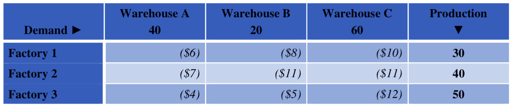
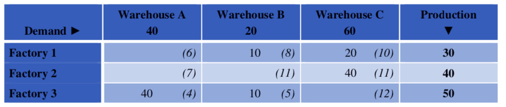
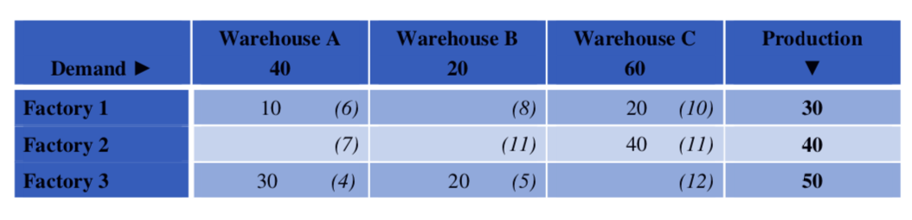

# MinimumCellCost-Steppingstone Transportation Problem
This assignment was for CSI2120(Programming Paradigms) Winter 2019. This unique problem was to be done in 3 different programming languages

Java

Go

Scheme

## Java
The java version can be executed via terminal/CMD by first compiling and than executing the Main.java file. During the execution one must provide one of the example tables provided in the folder.

javac Main.go
java Main 3by3_inputdata.txt

## Go 
The go version can be executed via terminal/CMD by simply executing

go run main.go

after exectution it will ask you for a file name. Provide one of the example tables provided in the folder. The initial solution and the stepping stone solution will be written to a document which is in the same dir called solution.txt.  

## Scheme

The scheme version can be executed in Dr.Racket. One must download the Dr.Racket IDE in order to run the scheme version.

Once opened up in Dr.Racket, click the run/play button.

The program is going to ask you to provide one of the example table files.

## About the Assignment

In this assignment, we study the classic problem of transporting goods to places where they are in demand. Suppose we have a number of factories, located in different locations and each having a certain production capacity. The goods produced must be sent to warehouses that are also located around the world and that, depending on demand, require a certain amount of goods. This can be represented by a table like this 

The above table contains the number of units produced by each factory and requested by each warehouse. The numbers in parentheses indicate the cost of transporting a unit from a factory to a warehouse. The problem is to find out how many goods are to be sent to each warehouse from each factory in order to minimize transportation costs. Note that we consider here the case where supply and demand are balanced.

This problem can be solved in different ways. In this assignment, we were to use the minimum cell cost and stepping stone algorithms, which proceeds in two steps: 

### Step i) (Minimum Cell Cost Method)

  The first step is to find an initial solution by distributing factory production amount to any warehouse by the lowest cost   of transportation(the numbers in paranthesis).  
  

### Step ii) (Stepping Stone)
  In the second step, the optimal solution is found by iteratively improving the current solution until an optimal solution     is reached.
  
